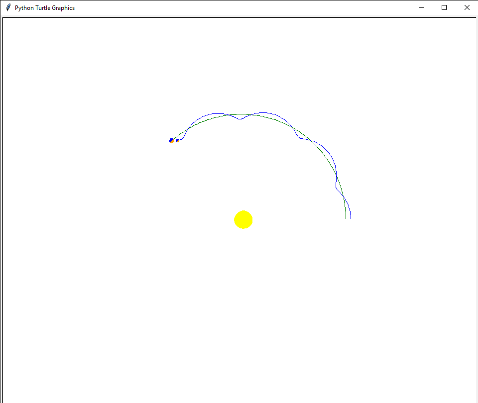
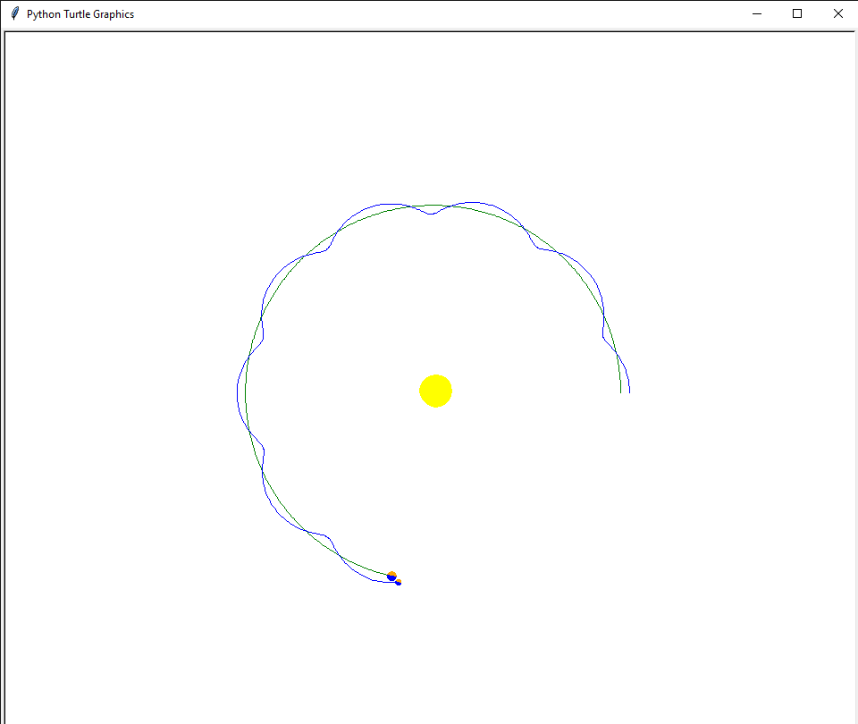
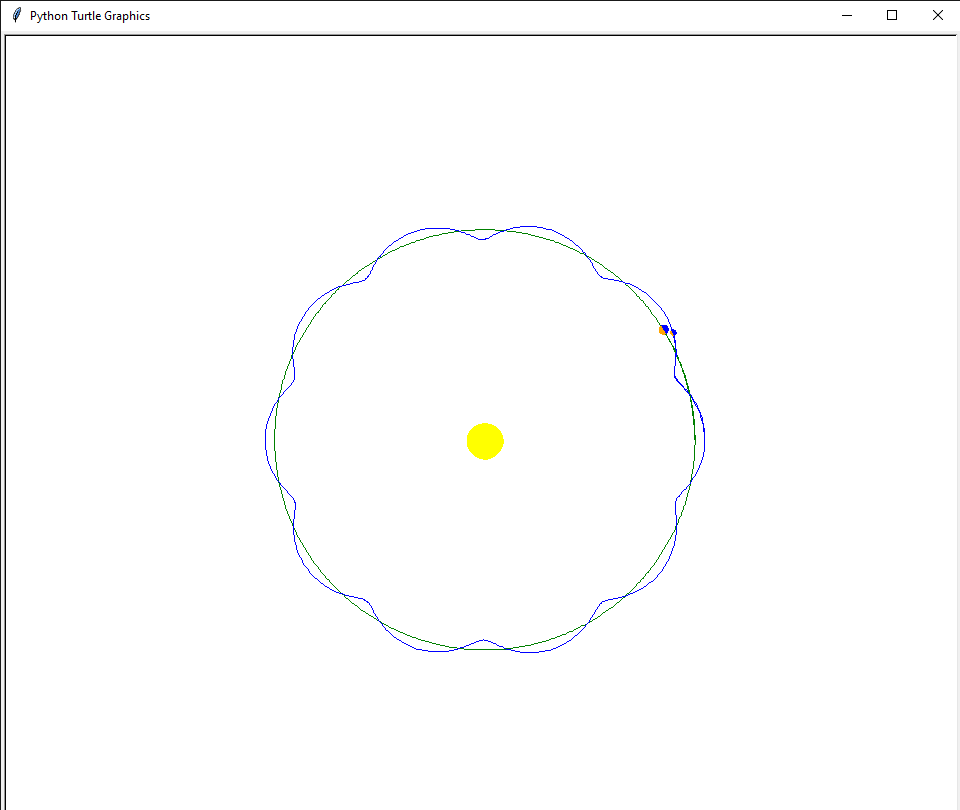

# Planets and Moon
This is a project, which is made using simple Turtle Graphics in Python. This will show you how the moon and Earth revolve around the Sun together and will help you understand the basics of these type of studies!

# Description
This Project is made using the Turtle Graphics, which use a very simple codes for the Output. It is made in Visual Studio Code (as I prefer it) but Python IDLE and Pycharm can also be used!

You will have fun while creating this program and feel good after seeing the Output.

The Python file (or .py file) is available in the files section of this Repository.

# Requirements of the Project

The Requirements are not as such. They are just the:

```
Python IDLE (or Visual Stusio Code or Pycharm, according to preferance)
Turtle Module (this pack comes inbuilt with the Python Installation)
```

# Screenshots of the Output
Before you all make your own project, just have a look at the output of the same. This tells about the revolution of the planets and theor moons around the Sun!
</img>
</img>
</img>

You can see the Output in this GIF File:

